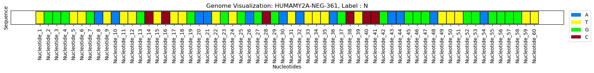
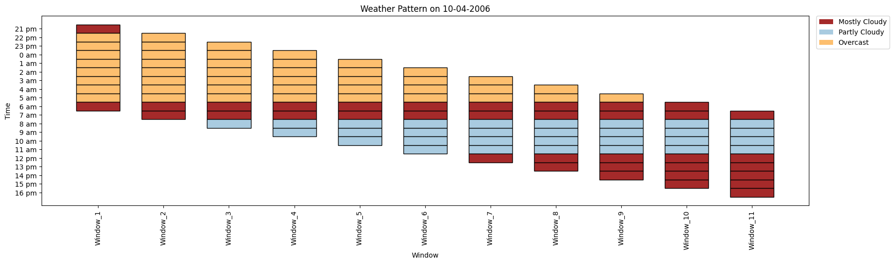

# KitikiPlot
<!--
## Table of Contents</h2>
- [Why Kitkiplot?](#What-and-why)
- [Getting Started](#getting-started)
- [Contribute](#contribute)
- [Maintainer(s)](#maintainer(s))
- [Citation](#citation)

## Why Kitikiplot?
-->

## Examples
Genome

<be>
CO Trend in Air

Weather Pattern


### Features

## Examples
__________Sample 2 examples goes here with attractive features

## Getting Started
Install the package via pip
```javascript
pip install kitikiplot
```
### Usage
Install the package via pip
```javascript
import kitikiplot
```

## Contribute
Contributions are welcomed!
Follow these steps to get started:

1. Fork the repository.
2. Create a new branch (git checkout -b name).
3. Commit your changes (git commit -m "Add new feature").
4. Push to your branch (git push origin feature-name).
5. Open a pull request.

## Authors
<a href="https://www.linkedin.com/in/boddusripavan/"> Boddu Sri Pavan </a> & 
<a href="https://www.linkedin.com/in/boddu-swathi-sree-2a2a58332/"> Boddu Swathi Sree </a>

## Citation

> @software{ <br/>
> package = {@learn-hunger/visual-gestures}, <br/>
> authors = {Boddu Sri Pavan& Boddu Swathi Sree}, <br/>
> title = {{KitikiPlot}}, <br/>
> year = {2024}, <br/>
> version = {0.0.1}, <br/>
> url = {\url{https://github.com/BodduSriPavan-111/kitikiplot}, <br/>
> howpublished = {\url{https://github.com/BodduSriPavan-111/kitikiplot}} <br/>
> }

## Thank You !
